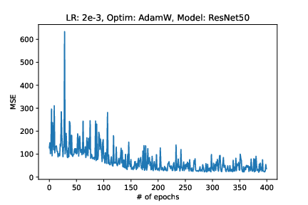
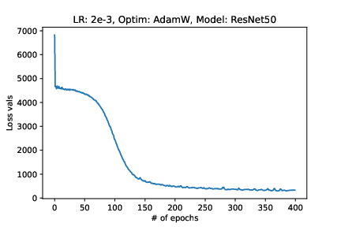
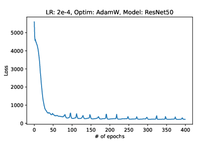
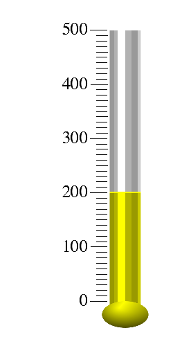
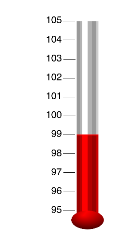
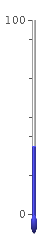

Predict thermometer readings from image with Deep Learning

### How this codebase works ?
The codebase follows the standard Pytorch conventions.

`model.py` contains the definition of a Model
`dataset.py` contains torch Dataset method which can be wrapped inside `DataLoader` as user intends. When transformations are passed to the method, the inputs and the targets will be both transformed.
`transforms.py` contains data augmentation methods. A lot of experimentation can be done with augmentation methods, but we sticked with the simpler ones for simplicity purposes
`train.py` contains the code for training and evaluating the model

### Model

The model is a ResNet50 (pre-trained on imagenet) followed by two FFNs with ReLU non-linearity. It outputs a single float value which is supposed to be the ground truth (relative reading). The choice of the model is totally dependent upon user. ResNet was chosen because of its simplicity, low inference time and performance.

### Metric
We used MSE for this problem. MSE is reflective of how far model's predictions are from the ground truth, and aims to minimize the gap. We used this metric for evaluating the model on validation as well. 

### Experiments

Results obtained on test set. We provide graphs instead of tables.

### Qualitative Results

Prediction = 40.1, Relative Reading = 40 (Correct)

Prediction = 35, Relative Reading = 35 (Correct)

Prediction = 44, Relative Reading = 40 (Mis-classified)

